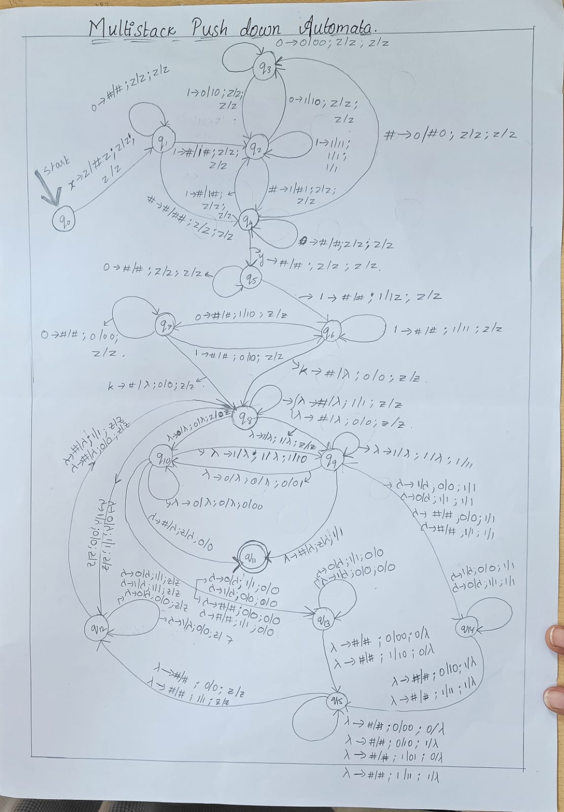

# TOC-Barcode_Scanner
3 stack Push down Automata and multi tape Turing Machine  for Barcode Scanner

# Library Barcode Scanning System Using Pushdown Automaton

## Overview
This project aims to develop an automated barcode scanning system for library books using a pushdown automaton (PDA) that simulates a Turing machine. The system enhances book tracking, inventory management, and transaction recording, thereby improving the efficiency and accuracy of library operations. By incorporating a barcode scanner, the system captures book information, which the PDA processes, updating the library's inventory and transaction records

# Pushdown Automaton
## A Pushdown Automaton (PDA) is a computational model that consists of:
where one stack contains the element to be searched contains 0`s and 1`s (call stack A)and the other stack is empty (Call stack B) and the other stack conatins the all the barcodes seperated with the delimiter and that also contains 0`s and 1`s (call stack C)  .. Logic:: when the first top elemnet of stack A matches the stack c then we pull stack c top element and from stack A we pull it and push it in stack .(this is beacuse if the input is not matched we will push all elements from stack B to stack A to start seaching again for other inputs). when there is no match of top element of both the stacks A and C , we pull elements in stack C until the delimeter and push Elements from Stack B to A , again start searching for other input

Q: A finite set of states.
Σ: Input alphabet (set of input symbols).
Γ: Stack alphabet (set of stack symbols).
δ: Transition function.
q0: Initial state.
z: Initial stack symbol.
F: Set of accepting states.
The PDA processes input by reading symbols, modifying the stack, and transitioning between states based on the current input and stack symbols. This enables the PDA to recognize and process context-free languages.

## PDA Design for Barcode Scanning System
### The PDA will be designed as:
M=(Q,Σ,Γ,δ,q0,z,F)
Where:
Q: States related to the different stages of processing the barcode.
Σ: Barcode symbols and delimiters.
Γ: Stack symbols used to manage barcode processing.
δ: Transition rules defining how the PDA moves between states.
q0: Initial state where the PDA starts.
z: Initial stack symbol.
F: Final states indicating successful barcode processing.

# Multi-Tape Turing Machine
 To enhance the capabilities of our system, we will simulate a multi-tape Turing machine using the PDA. The multi-tape ## Turing machine will use:

 Tape 1: For input search elements.
 Tape 2: For unique IDs in binary form, separated by a delimiter 'x'.
## Working of Multi-Tape Turing Machine
Input on Tape 1: The search element.
Input on Tape 2: Unique IDs in binary, separated by 'x'.
## Search Process:
- The machine searches for the element on Tape 1 within Tape 2.
- If not found, it returns to the starting point on Tape 1 and searches the next element on Tape 2.
- Continues until the element is found or all elements are exhausted.
- If found, the machine reaches a final state.
- If not found, the machine halts in an intermediate state.

# Conclusion
The automated barcode scanning system using a pushdown automaton that simulates a Turing machine provides an efficient and accurate solution for library book tracking and inventory management. The theoretical foundation, coupled with the flexibility, computational power, and scalability of the PDA, makes it an ideal choice for enhancing library operations.

## Documentation

For further details and implementation instructions, please refer to the [Project Report](TEAM-9-CaseStudy_TOC.docx).

## Contact

Feel free to contact me  for any queries or further information.

[Email me ](likithapicheri500k@gmail.com)

